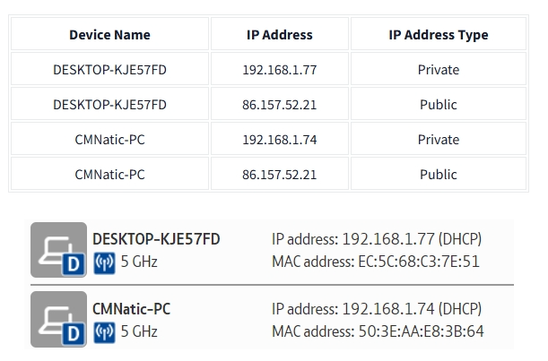

# Definition
- **Network** are simply devices connected.
- **Internet** is one giant network that consists of many, many small network within itself.

- These small networks are called private networks, where networks connecting these smll networks are called public network. So, a network can be one of 2 types:
  + A private network
  + A public network
 
# Identifying Devices on Network
## IP address
- An IP address can be used as a way of identifying a host on a network for a period of time, where that IP address can then be associated with another device without changing the IP address.

- The IP address can change from device to device but cannot active simultaneously more than once within the same network.

- Devices can be both a private and public network. A public network address is used to identify the device on the Internet, whereas a private address is used to identify a device amongst other devices.

- For example, these two devices will be albe to use their private IP address to communicate with each other. However, any data sent to the Internet from either of these devices will be identifies by the same public IP address. Public Ip addresses is given by your ISP local.

## MAC addresses
- MAC address is a microchip board found on the devices's motherboard. It is a unique address at the factory it was built at. The MAC address is a **twelve-character** hexadecimal number split into two's and separated by a colon.

- MAC can be faked or *spoofed* in a process known as spoofing. 

## Ping (ICMP)
- Ping dùng ICMP protocol để quyết định hiệu suất kết nối (perfomace of a connection) giữa 2 thiết bị, nếu kết nối có tồn tại.

- Thời gian gửi, nhận ICMP packet đc đo bằng Ping. 

- Syntax: ping IP or URL

- Here we are pinging a device that has the private network of 192.168.1.254. Ping báo chúng ta có 6 ICMP pakcets, thời gian gửi trung bình là 4.160 mili giây.